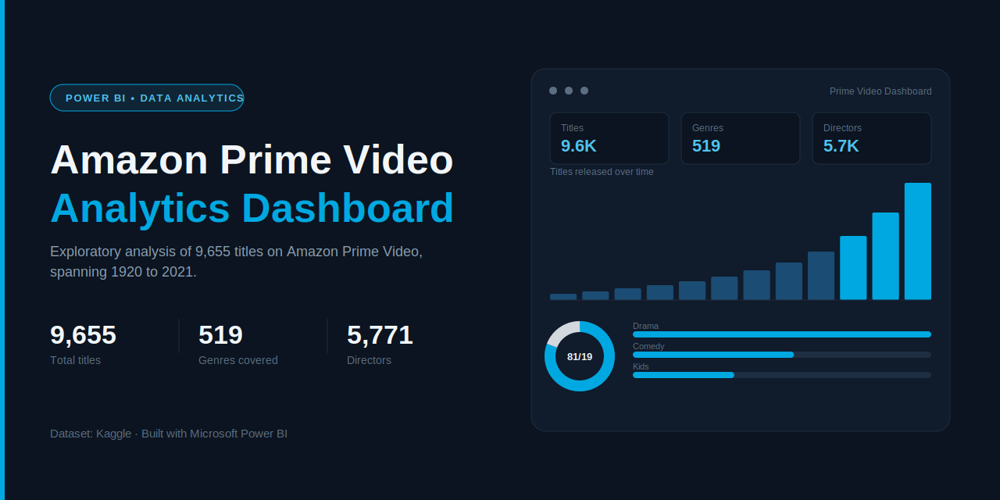

<p align="center">
  
</p>

<h1 align="center">Analytics, Insights of Amazon Prime Video with BI — Content Analytics Dashboard</h1>

<p align="center">
  An interactive Power BI dashboard analyzing 9,655 Amazon Prime Video titles (1920–2021) —
  genres, ratings, directors, countries, and release trends.
</p>

<p align="center">
  
  
  
</p>

---

## Overview

This project turns a raw catalog of Amazon Prime Video titles into a single-page Power BI report that answers the questions a content or business analyst would actually ask:

- How has the catalog grown over time, and when did that growth accelerate?
- What's the real split between movies and TV shows?
- Which genres, ratings, and countries dominate the library?
- Who are the most prolific directors on the platform?

The dashboard is a KPI + visual-story layout: a top strip of headline metrics, a geographic view of content origin, and drill-down charts for ratings, genres, and release trends — all cross-filterable.

## Preview

<p align="center">
  
</p>

## Dataset

| | |
|---|---|
| **Source** | [Kaggle — Amazon Prime Movies and TV Shows](https://www.kaggle.com/) |
| **File** | `amazon_prime_titles.csv` |
| **Rows** | 9,668 titles |
| **Columns** | `show_id`, `type`, `title`, `director`, `cast`, `country`, `date_added`, `release_year`, `rating`, `duration`, `listed_in` (genres), `description` |
| **Coverage** | Release years 1920–2021 |

Notable data quality characteristics handled in the model:

- `country` is missing for ~93% of rows and `date_added` for ~98% — both are treated as directional signals, not complete fields.
- `director` is missing for ~22% of rows; the "Total Directors" KPI counts distinct known values.
- `rating` has a small number of blanks, grouped separately in the ratings breakdown.

## Key insights from the dashboard

- **9,655** total titles across **519** genre combinations and **5,771** credited directors.
- **Movies dominate the catalog** — roughly **81%** movies vs **19%** TV shows.
- **Catalog growth is heavily back-loaded**: the vast majority of titles were released after 2000, with a sharp acceleration in the last few years of the dataset.
- **Drama** is the single largest genre tag (986 titles), followed by **Comedy** (536) and genre combinations like **Drama/Suspense** and **Comedy/Drama**.
- **13+** is the most common content rating, ahead of **16+**, **ALL**, and **18+** — indicating a catalog skewed toward general and teen audiences rather than strictly adult content.

## Dashboard features

- **KPI strip** — total titles, ratings, genres, directors, and the year range at a glance.
- **Total Shows by Country** — a map visual showing where content originates.
- **Total Shows by Release Year** — a stacked area/bar view split by Movie vs TV Show, showing the platform's growth curve.
- **Ratings by Total Shows** — horizontal bar breakdown of content ratings (13+, 16+, ALL, 18+, R, PG-13, 7+).
- **Movies vs TV Shows** — a donut chart summarizing content-type mix.
- **Genres by Total Shows** — top genre tags ranked by volume.
- Every visual is cross-filterable — clicking a country, genre, or rating filters the rest of the report.

## Tech stack

- **Microsoft Power BI Desktop** — data modeling, DAX measures, and report design
- **Power Query** — data cleaning and shaping from the raw CSV
- **Kaggle CSV dataset** as the single source of truth

## Repository structure

```
├── Amazon Prime Video Dashboard.pbix        # Power BI report file
├── amazon_prime_titles.csv                  # Source dataset
├── Amazon Prime Video Dashboard by Vikram Kumar.png   # Full dashboard screenshot
├── thumbnail-github-social.png              # Social preview banner (this repo)
├── thumbnail-linkedin.png                   # LinkedIn post cover
└── README.md
```

## How to run it locally

1. Install [Power BI Desktop](https://www.microsoft.com/en-us/power-platform/products/power-bi/desktop) (Windows only, free).
2. Clone this repository:
   ```bash
   git clone https://github.com/minhaj-313/Amazon-Prime-Video-Dashboard-Using-PowerBi.git
   ```
3. Open `Amazon Prime Video Dashboard.pbix` in Power BI Desktop.
4. If prompted, point the data source to the local path of `amazon_prime_titles.csv`.
5. Explore — every chart is interactive and cross-filters the rest of the report.

## Possible next steps

- Add a director/cast-level drill-through page.
- Normalize `duration` into a consistent numeric field to compare movie length vs TV season count.
- Layer in a proper date table to unlock time-intelligence DAX on `date_added`.
- Publish to Power BI Service and embed a live report link here.

## Author

**Vikram Kumar**
📧 sirvkparmar@gmail.com

If you use or fork this project, a ⭐ on the repo is appreciated.

## License

This project is released under the MIT License. The dataset belongs to its original Kaggle source and is used here for educational/analytical purposes.
